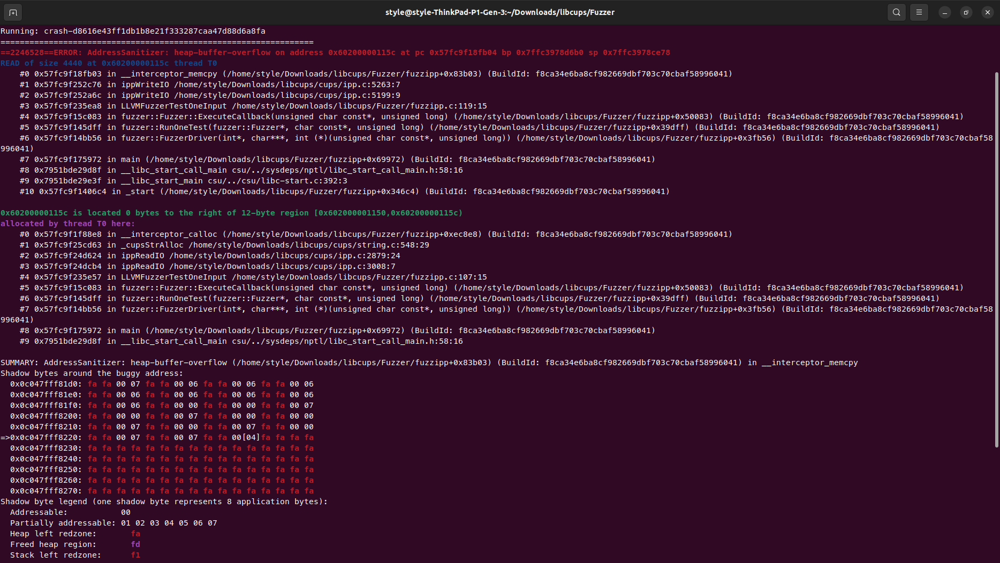
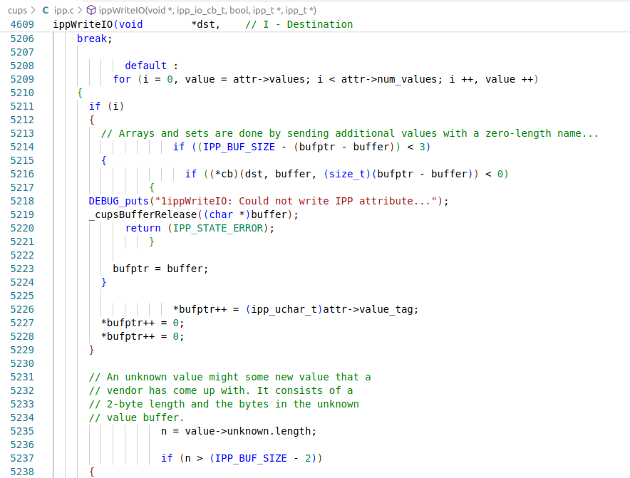
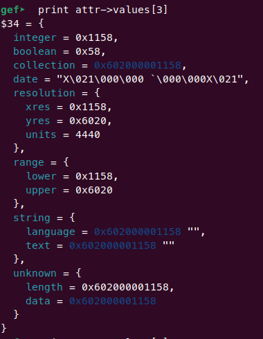

## xxxx

### 详细信息


### 修复


### 调试
#### 1.测试样例
运行./fuzzipp crash-d8616e43ff1db1b8e21f333287caa47d88d6a8fa，得到下面的结果

可以看到溢出前函数调用的过程，然后程序溢出点的位置在0x60200000115c，发生在memcpy函数中，由于复制的数据长度超过了目标变量的大小从而造成溢出，而目标变量则是通过calloc进行分配大小。
#### 2.静态分析
将其首先定位到ippWriteIO /home/style/Downloads/libcups/cups/ipp.c:5263位置，这个函数在传入参数后会通过一个swtich语句的判断，然后进入对应的处理分支，在该漏洞的触发点上，这里直接进入了default分支：

这部分的函数功能通过chatgpt可以得到函数功能为：在每次迭代中，它检查缓冲区的剩余空间是否足够容纳当前值。如果不够，它会调用提供的回调函数来将已填充的缓冲区发送给目标。然后，它重新开始填充新的缓冲区，并继续添加数据。然后可以指导当剩余的数据>0时，然后进入if分支运行memcpy函数造成溢出：
```
if (n > 0)
{
    memcpy(bufptr, value->unknown.data, (size_t)n);
    bufptr += n;
}
```
#### 3.动态分析
下面进行调试，通过gdb --args ./fuzzipp crash-d8616e43ff1db1b8e21f333287caa47d88d6a8fa挂载程序，并设置断点：

然后r运行后输入c：

可以看到这里通过调用ippWriteIO函数进行了目标写操作：
然后进入c，进入ippWriteIO函数内部：

然后这里重点关注memcpy函数对应的几个变量的值，通过调试可以看到value和n的值一直是变化的，n通过n = value->unknown.length;语句进行变化，然后当i=3时候，value变量的值如下：

然后n由于是一个int型，所以只得到后面64位变成0x1158，然后调用memcpy后直接超出了buffer原始的大小，造成了溢出。
### 触发信息

触发时的漏洞信息如下所示：
```


```